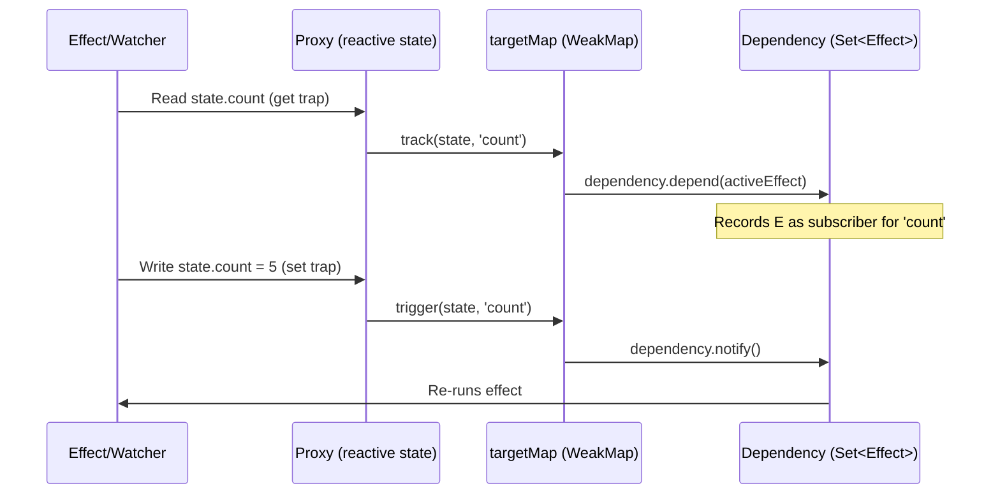
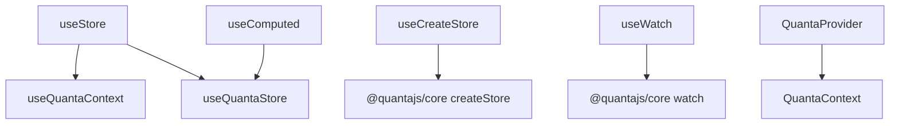

# QuantaJS — In-Depth Project Knowledge

## What Is QuantaJS?

QuantaJS is a **framework-agnostic reactive state management library** published as three npm packages under `@quantajs/*`. It uses JavaScript `Proxy` to automatically track property access and trigger re-renders when state changes — similar to Vue 3's reactivity system, but designed to work with any framework (React, Vue, Svelte, vanilla JS).

**Current version:** `2.0.0-beta.9`

---

## How the Reactivity System Works

### The Core Loop: track → mutate → trigger → re-run



### Key Data Structures

| Structure | Type | Purpose |
|-----------|------|---------|
| `targetMap` | `WeakMap<object, Record<prop, Dependency>>` | Maps reactive objects → their per-property dependency sets |
| `reactiveMap` | `WeakMap<object, Proxy>` | Caches Proxy wrappers to prevent double-wrapping |
| `parentMap` | `WeakMap<object, {parent, key}>` | Tracks parent→child relationships for bubble triggering |
| `storeRegistry` | `Map<string, StoreInstance>` | Global registry of named stores |
| `initialStateMap` | `WeakMap<StoreInstance, state>` | Stores initial state for `$reset()` |
| `effectStack` | `Array<StoreSubscriber>` | Stack for tracking nested effect execution |
| `activeEffect` | `StoreSubscriber \| null` | Currently executing effect (for dependency collection) |

### Proxy Traps (create-reactive.ts)

| Trap | Tracks? | Triggers? | Notes |
|------|---------|-----------|-------|
| `get` | ✅ `track()` | — | Recursively wraps nested objects, sets `parentMap` |
| `set` | — | ✅ `trigger()` + `bubbleTrigger()` | Compares old/new values, wraps new objects |
| `deleteProperty` | — | ✅ `trigger()` | Only triggers if property existed |
| `has` | ✅ `track()` | — | For `'key' in proxy` |
| `ownKeys` | ✅ `track('keys')` | — | For `Object.keys()`, `for...in` |
| `getOwnPropertyDescriptor` | ✅ `track()` | — | |

### Store Lifecycle

```mermaid
graph LR
    A["createStore(name, opts)"] --> B["reactive(opts.state())"]
    B --> C["Register deep watcher via reactiveEffect"]
    C --> D["Create computed getters"]
    D --> E["Setup persistence manager"]
    E --> F["Create flat Proxy via flattenStore()"]
    F --> G["Bind actions with this = flatProxy"]
    G --> H["Register in storeRegistry"]
    H --> I["Return flattenedStore"]
```



---

## Package-by-Package Detail

### @quantajs/core

**Entry:** `src/index.ts` → exports `reactive`, `computed`, `watch`, `createStore`, `useStore`, persistence, logger, types

#### Files and Responsibilities

| File | Size | Responsibility |
|------|------|----------------|
| `core/create-reactive.ts` | 299 lines | Proxy creation for objects, arrays, Maps, Sets |
| `core/create-store.ts` | 281 lines | Store factory: state, getters, actions, persistence, registry |
| `core/effect.ts` | 190 lines | `track()`, `trigger()`, `reactiveEffect()`, `batchEffects()`, effect stack |
| `core/dependency.ts` | 77 lines | Subscriber set management (add, remove, notify, clear) |
| `state/reactive.ts` | 17 lines | Thin wrapper around `createReactive()` |
| `state/computed.ts` | 49 lines | Computed values using `reactiveEffect` + value getter |
| `state/watch.ts` | 94 lines | Shallow (effect-based) and deep (polling) watchers |
| `utils/flattenStore.ts` | 107 lines | Proxy that unifies state/getters/actions on one object |
| `utils/deep-trigger.ts` | 78 lines | `bubbleTrigger()` + `parentMap` for nested change propagation |
| `utils/debouce.ts` | 76 lines | Debounce utility with flush/cancel |
| `persistence/core.ts` | 275 lines | Persistence manager: save/load/clear, auto-save via watch, cross-tab sync |
| `persistence/migrations.ts` | 292 lines | Schema migration system with common migration helpers |
| `persistence/adapters/*` | ~55 each | LocalStorage, SessionStorage, IndexedDB adapters |
| `services/logger-service.ts` | 300 lines | Configurable logger with levels, colors, environment detection |
| `devtools/index.ts` | 100 lines | DevToolsBridge: event emission for store init, state changes, action calls |

#### Type System (`type/store-types.ts`)

The `StoreInstance<S, GDefs, A>` type is a complex intersection:

```typescript
type StoreInstance<S, GDefs, A> = 
    S &                                    // State properties directly accessible
    InferGetterReturnTypesFromDefs<S, GDefs> &  // Getter values directly accessible
    InferActions<S, GDefs, A> &            // Action methods directly accessible
    {
        state: S;                          // Also available as store.state.x
        getters: { [K in keyof GDefs]: any };
        actions: A;
        subscribe: (cb) => () => void;
        $reset: () => void;
        $persist?: PersistenceManager;
        $destroy?: () => void;
    };
```

This means `store.count` and `store.state.count` both work — the flattenStore Proxy handles the routing.

---

### @quantajs/react

**Entry:** `src/index.ts` → exports hooks, components, context, re-exports core

#### React Integration Strategy

Uses `useSyncExternalStore` (React 18+) which requires:
1. `subscribe(callback)` — register for change notifications, return unsubscribe
2. `getSnapshot()` — return current state (must be referentially stable when unchanged)

**Without selector:** Builds a snapshot object from state/getters/actions, invalidated on any change.

**With selector:** Runs selector on store, caches result, only notifies React when selected value changes (shallow equality).

#### Hook Dependencies



---

### @quantajs/devtools

**Built with Preact** (not React) to be framework-agnostic. Renders inside a Shadow DOM container.

- `DevToolsBridge` (in core) emits events: STORE_INIT, STATE_CHANGE, ACTION_CALL
- `mountDevTools()` creates Shadow DOM, renders Preact app
- `useDevToolsBridge()` hook subscribes to bridge events
- Components: `StoreInspector` (state tree viewer), `ActionLog` (action history)
- Uses Tailwind CSS v4 + `tailwind-merge` + `clsx` for styling

---

## Critical Implementation Details for Agents

### 1. The Two Proxy Layers

Every store has **two layers** of Proxy:
1. **Reactive Proxy** (`createReactive`) — handles tracking/triggering
2. **Flatten Proxy** (`flattenStore`) — routes `store.x` to `store.state.x`, `store.getters.x.value`, or `store.actions.x`

When you access `store.count`, it goes through:
```
FlattenProxy.get('count') → checks state → Reactive Proxy.get('count') → track() → return value
```

### 2. Effect Registration

Effects are registered by **running them once** during `reactiveEffect()`. As the effect function executes, it reads reactive properties, which triggers `track()` calls that record the effect as a subscriber. This is the same pattern as Vue's `watchEffect`.

### 3. Persistence Auto-Save

The persistence system sets up a `watch(..., { deep: true })` which uses `setInterval(100ms)` + `JSON.stringify` to detect changes. This is an intentional (if suboptimal) design choice to avoid deeply tracking all nested properties.

### 4. Store Name Uniqueness

Store names are globally unique. Creating a second store with the same name throws. The `useStore(name)` function retrieves by name. In React, you can also use `QuantaProvider` with context-based store access.

### 5. DevTools Integration

The `devtools` singleton in core emits events on every state mutation and action call. This is always active (no production gating). The devtools UI is separate (`@quantajs/devtools` package) and only renders when explicitly mounted.
