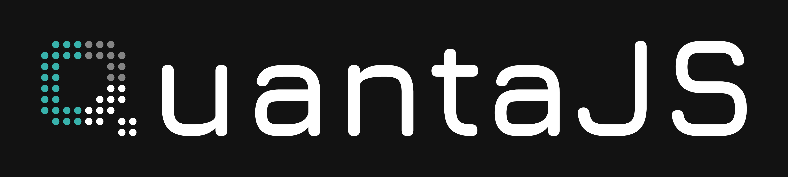

# QuantaJS


[](https://github.com/quanta-js/quanta/actions/workflows/ci.yml)
[](https://codecov.io/gh/quanta-js/quanta)

A compact, scalable, and developer-friendly **state management library** designed for any JavaScript environment. It includes a **reactivity system** that enables efficient and flexible data handling, making complex state management easy.


## 🚀 Features

✅ **Framework-Agnostic** – Works in any JavaScript environment  
✅ **Reactive State** – Simple yet powerful reactivity system  
✅ **Scalable** – Suitable for small to large applications  
✅ **Side Effects Handling** – Manage async actions with ease  
✅ **Intuitive API** – Easy to learn and use  


## 📦 Installation

```sh
npm install @quantajs/core
# or
yarn add @quantajs/core
# or
pnpm add @quantajs/core
```

## ⚡ Quick Start

```javascript
import { createStore } from "@quantajs/core";

const counter = createStore("counter", {
  state: () => ({ count: 0 }),
  actions: {
    increment() {
      this.count++;
    },
    decrement() {
      this.count--;
    },
  },
});

console.log(counter.count); // 0
counter.increment();
console.log(counter.count); // 1

```


## 📜 License
This project is licensed under the MIT [License](/LICENSE) - see the LICENSE file for details.

## Get Started
Ready to dive in? Check out the [Installation](https://www.quantajs.com/docs/getting-started/installation) guide or explore the [Quick Start](https://www.quantajs.com/docs/getting-started/quick-start-guide) to see QuantaJS in action!

## 💬 Contributing
We welcome contributions! Feel free to open issues, submit PRs, or suggest improvements.

## ⭐ Support
If you find this library useful, consider giving it a ⭐ star on [GitHub](https://github.com/quanta-js/quanta)!
